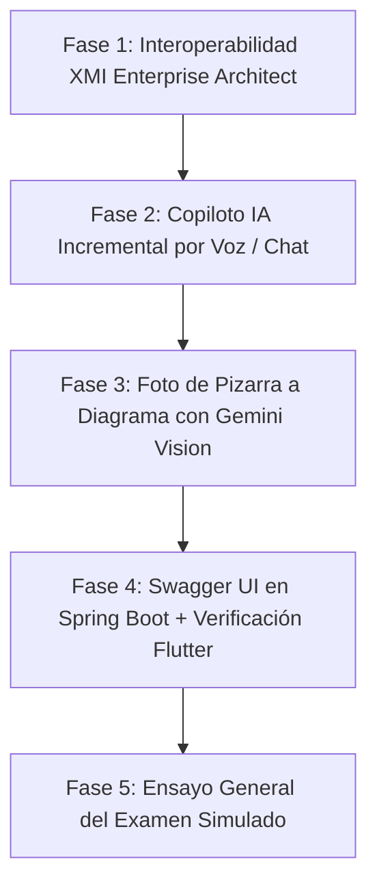

# 🎯 PLAN MAESTRO: INFRAESTRUCTURA CASE COLABORATIVA CON IA
## Examen y Defensa de Ingeniería de Software 1 (UAGRM)

---

## 📌 1. Contexto Académico y Dinámica del Examen

### El Problema Planteado por el Docente
> *"Dotar de una infraestructura a una empresa de desarrollo que les permita construir software de forma colaborativa y remota (Ingeniería de Software Asistida por Computadora - CASE), donde el diseño genere automáticamente la implementación (Backend Spring Boot + PostgreSQL + Frontend Móvil), con soporte de IA (comandos de voz y visión de pizarra) e interoperabilidad con Enterprise Architect (.xmi)."*

### Lo que Ocurrirá el Día del Examen
1. **Caso en la Pizarra:** El docente planteará un caso de gestión (clínica, colegio, ventas, contabilidad) en la pizarra o dictado.
2. **Captura del Diagrama:** Se demostrará la captura mediante:
   - 📸 **Foto de la pizarra:** La IA Vision analiza la imagen y genera el diagrama en el lienzo.
   - 🎤 **Comandos de voz:** Dictado interactivo (*"Crea la clase Factura con id, fecha y total..."*, *"Relaciona Cliente con Factura por composición..."*).
3. **Colaboración Multiusuario:** Dos o más integrantes se conectan a la misma sala (código UUID) y editan simultáneamente en tiempo real.
4. **Prueba de Interoperabilidad con Enterprise Architect:**
   - Exportar el diagrama a formato estándar `.xmi` y abrirlo en Enterprise Architect.
   - Importar un archivo `.xmi` generado en Enterprise Architect hacia nuestro sistema web.
5. **Generación Automática de Implementación:**
   - Clic en **Generar Backend Spring Boot 3**: descarga el `.zip` con arquitectura en capas (`@Entity`, `Repository`, `Service`, `Controller`, `pom.xml`).
   - Ejecución en PostgreSQL y verificación inmediata en **Postman** (con la colección JSON autogenerada) o en **Swagger UI**.
   - Clic en **Generar Frontend Móvil**: descarga del proyecto **Flutter CRUD** listo para consumir los endpoints.

---

## 📊 2. Matriz de Estado: Qué Tenemos vs. Qué Falta

| Módulo / Requisito | Estado | ¿Qué está listo al 100%? | ¿Qué falta implementar? |
| :--- | :---: | :--- | :--- |
| **1. Diagramador UML 2.5+** | ✅ **100%** | Clases, atributos, métodos, 5 relaciones formales (Asociación, Herencia, Agregación, Composición, Dependencia), cardinalidades, navegación Figma/Miro (Pan/Zoom/Touchpad), edición inline y drag & drop milimétricos. | Ninguno. Módulo visual y ergonómico completado. |
| **2. Persistencia en PostgreSQL** | ✅ **100%** | Respaldo inmediato al borrar, debounced 500ms al mover, persistencia de lienzos vacíos sin clases fantasma, aislamiento por sala UUID. | Ninguno. Persistencia relacional verificada. |
| **3. Colaboración en Tiempo Real** | ✅ **95%** | WebSockets Django Channels (`ws/canvas/<room_id>/`), P2P WebRTC, sincronización de clases y enlaces entre varios navegadores. | Pulir la experiencia de bienvenida en sala nueva. |
| **4. Backend Spring Boot + Postman** | ✅ **95%** | Arquitectura en capas limpia (`Entity`, `Repository`, `Service`, `Controller`), tipos JPA mapeados, `pom.xml`, colección Postman v2.1 en `.zip`. | Agregar Swagger UI (`springdoc-openapi`) para visualización web interactiva. |
| **5. Interoperabilidad Enterprise Architect (.xmi)** | ❌ **0%** | Exportación a JSON, SQL y PNG. | 🚨 **FALTA CRÍTICA (Prioridad 1):** Generador y lector de archivos `.xmi` estándar OMG UML 2.1/2.5. |
| **6. Copiloto IA por Voz (Edición Incremental)** | ⚠️ **40%** | Micrófono Web Speech API y generación de diagrama completo desde cero. | 🚨 **FALTA CLAVE (Prioridad 2):** Comandos de modificación en vivo (*"agrega atributo"*, *"relaciona"*, *"modifica"*, *"elimina"*) sin borrar el diagrama existente. |
| **7. Foto de Pizarra a Diagrama (Visión IA)** | ⚠️ **60%** | Servicio `call_gemini_from_image` y botón de subida en frontend listos. | Configurar `GEMINI_API_KEY` en `.env` y calibrar el prompt para dibujos a mano alzada. |
| **8. Frontend Móvil Flutter CRUD** | ⚠️ **50%** | `flutter_generator.py` en Django (2,600 líneas Dart). | Verificar que el proyecto generado compile y conecte con el Spring Boot generado. |

---

## 🗺️ 3. Hoja de Ruta Paso a Paso (Plan de Ejecución)



### 🔹 FASE 1: Interoperabilidad XMI con Enterprise Architect (Prioridad Alta)
- [ ] **1.1 Exportador XMI (`XmiExportService` en Angular):**
  - Transformar el JSON de JointJS al estándar XML OMG `uml:Model` con `xmi:version="2.1"`.
  - Mapear clases (`<packagedElement xmi:type="uml:Class">`), atributos (`<ownedAttribute>`), tipos primitivos UML y relaciones (`<packagedElement xmi:type="uml:Association">`, `Generalization`, `Dependency`).
  - Agregar botón de descarga en el panel derecho: **"Exportar a Enterprise Architect (.xmi)"**.
- [ ] **1.2 Importador XMI (`XmiImportService` en Angular):**
  - Cargar archivo `.xmi` o `.xml` exportado desde Enterprise Architect.
  - Parsear el árbol XML en el navegador con `DOMParser`.
  - Reconstruir automáticamente las clases y sus relaciones en el lienzo JointJS.
  - Botón en el panel derecho: **"Importar desde Enterprise Architect (.xmi)"**.

### 🔹 FASE 2: Copiloto IA Incremental por Voz y Chat (Prioridad Alta)
- [ ] **2.1 Intérprete de Intenciones CRUD:**
  - Adaptar el backend de Gemini en Django para que devuelva una acción estructurada en lugar de reemplazar todo el grafo:
    - `{ action: 'add_class', name: 'Factura', attributes: [...], methods: [...] }`
    - `{ action: 'add_attribute', className: 'Cliente', attribute: { name: 'telefono', type: 'string' } }`
    - `{ action: 'add_relationship', source: 'Cliente', target: 'Factura', type: 'composition' }`
    - `{ action: 'delete_class', name: 'Perro' }`
- [ ] **2.2 Ejecutor en el Lienzo:**
  - `DiagramService` recibe la acción y ejecuta la mutación en pantalla de forma suave y localizada.
  - Emite la actualización por WebSocket a todos los usuarios conectados sin parpadeos ni recargas.

### 🔹 FASE 3: Calibración de Visión IA para Foto de Pizarra (Prioridad Media-Alta)
- [ ] **3.1 Credenciales y Configuración:**
  - Crear archivo `.env` en `backend_ia_colaboracion/` con `GEMINI_API_KEY`.
- [ ] **3.2 Calibración de Prompts para Pizarra:**
  - Optimizar el prompt de `call_gemini_from_image` para tolerar trazos imperfectos de marcador, flechas a mano alzada y texto manuscrito.
  - Pruebas reales con fotos de diagramas dibujados en papel.

### 🔹 FASE 4: Swagger UI en Spring Boot y Validación Flutter (Prioridad Media)
- [ ] **4.1 Swagger UI en el Backend Generado:**
  - Incluir la dependencia `springdoc-openapi-starter-webmvc-ui` en el `pom.mustache`.
  - Al ejecutar el backend generado, los endpoints estarán documentados e interactivos en `http://localhost:8080/swagger-ui.html`.
- [ ] **4.2 Validación del Proyecto Flutter Móvil:**
  - Probar generación de un CRUD Flutter con 3 tablas asociadas y validar su estructura con `dart analyze`.

### 🔹 FASE 5: Ensayo General del Examen (Simulacro)
- [ ] Realizar un ejercicio completo de punta a punta:
  1. Tomar un caso de gestión al azar (ej. *Sistema de Préstamos de Biblioteca*).
  2. Dibujarlo por voz y foto.
  3. Exportarlo a XMI y abrirlo en Enterprise Architect.
  4. Generar el backend Spring Boot, levantarlo y probarlo en Postman.
  5. Conectar la app móvil.

---

## 🛠️ 4. Guía de Inicio Rápido de Servicios Locales

Para levantar el ecosistema completo durante el examen o desarrollo:

```bash
# 1. Base de Datos (PostgreSQL 17)
# Puerto: 5432 | BD: uml_bd

# 2. Backend IA & Colaboración (Django Channels)
cd backend_ia_colaboracion
venv\Scripts\activate
daphne -b 127.0.0.1 -p 8000 diagramador_uml.asgi:application

# 3. Backend Generador (Spring Boot 3 / Java 21)
cd backend_generador_spring
set JAVA_HOME=C:\Program Files\Java\jdk-21
mvnw.cmd spring-boot:run

# 4. Frontend Diagramador (Angular 20)
cd frontend_diagramador_uml
npm start
# Abrir en navegador: http://localhost:4200/
```

---

## 🛡️ 5. Conceptos de Calidad y Arquitectura para la Defensa

| Criterio ISO/IEC 25010 | Implementación Técnica en el Proyecto |
| :--- | :--- |
| **Corrección Funcional** | Generación de código fiel al diagrama (relaciones 1 a N mapped a `@OneToMany`/`@ManyToOne`). |
| **Interoperabilidad** | Exportación/Importación estándar XMI (OMG) y colecciones Postman v2.1. |
| **Fiabilidad** | Persistencia tolerante a fallos: `localStorage` + guardado debounced/inmediato en PostgreSQL. |
| **Usabilidad (UX)** | Experiencia de usuario estilo herramientas profesionales (Miro/Figma/EA), atajos de teclado y voz. |
| **Mantenibilidad** | Microservicios desacoplados (Frontend Angular, Backend Django Channels, Generador Spring Boot). |
